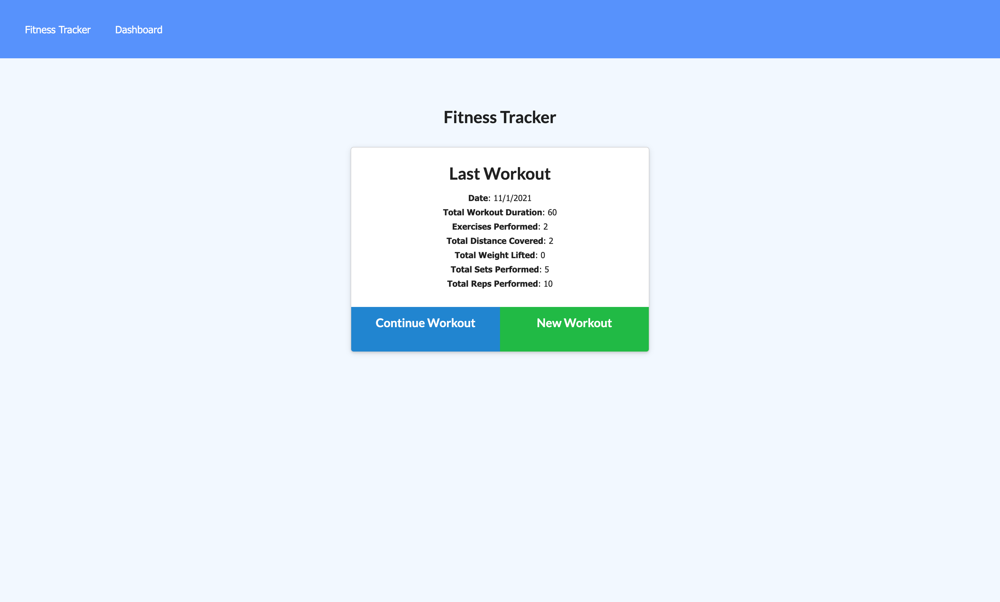
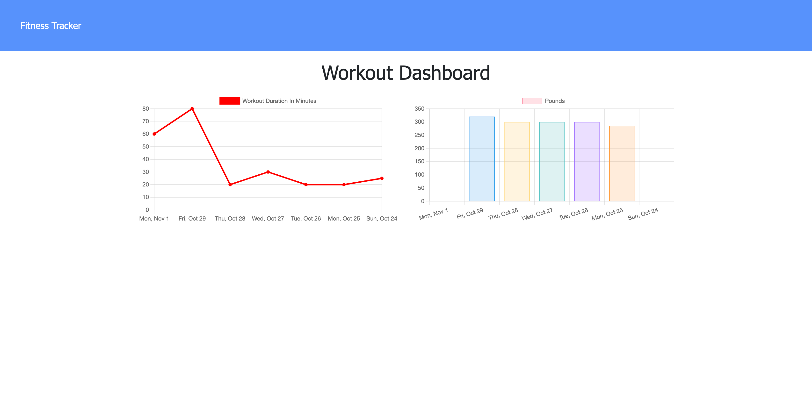
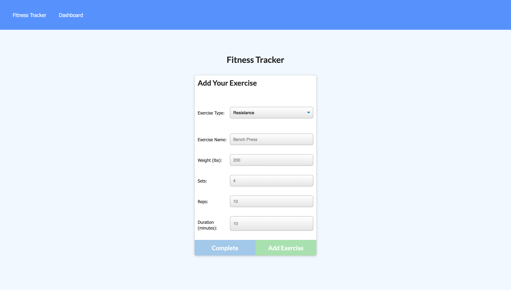

# fitness-tracker

## Description

This is a full-stack application that logs and tracks a user's workouts over time. All data is stored in a MongoDB database.







## Table of Contents

- [Installation](#installation)
- [Usage](#usage)
- [Credits](#credits)
- [License](#license)
- [Links](#links)
- [Questions](#questions)

## Installation

Use the following command to install dependencies:

```
$ npm i
```

MongoDB must be installed in order to use this app locally. Once the Mongo server is running, create and seed the database with this command:

```
$ node seeders/seed.js
```

The following command initializes the app:

```
$ node server.js
```

## Usage

When used in the browser, a user is first brought to the homepage where they can start or continue logging a workout. If a workout was already started, the stats for that workout are presented on the homepage. Once the user has finished adding their exercises to a workout, they can select "Complete" on the form page. The dashboard page shows two graphs depicting total duration in minutes for each workout logged as well as total weight lifted in pounds during each workout.

## Credits

N/A

## License

This project is licensed under the MIT license.

## Links

This application is deployed to Heroku and can be viewed [here](https://mighty-plateau-64624.herokuapp.com/).

## Questions

If you have any questions about this repository, contact me directly at liaobrien123@gmail.com. You can find more of my work at [liaobrien](https://github.com/liaobrien).
